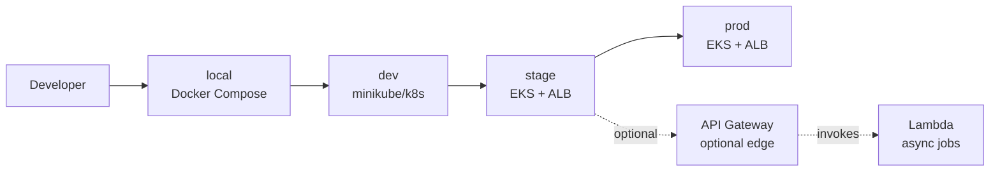
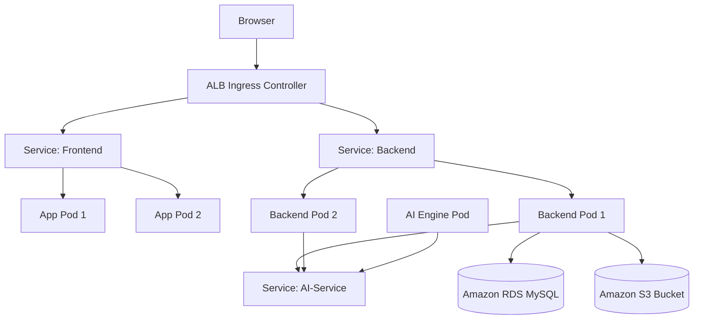
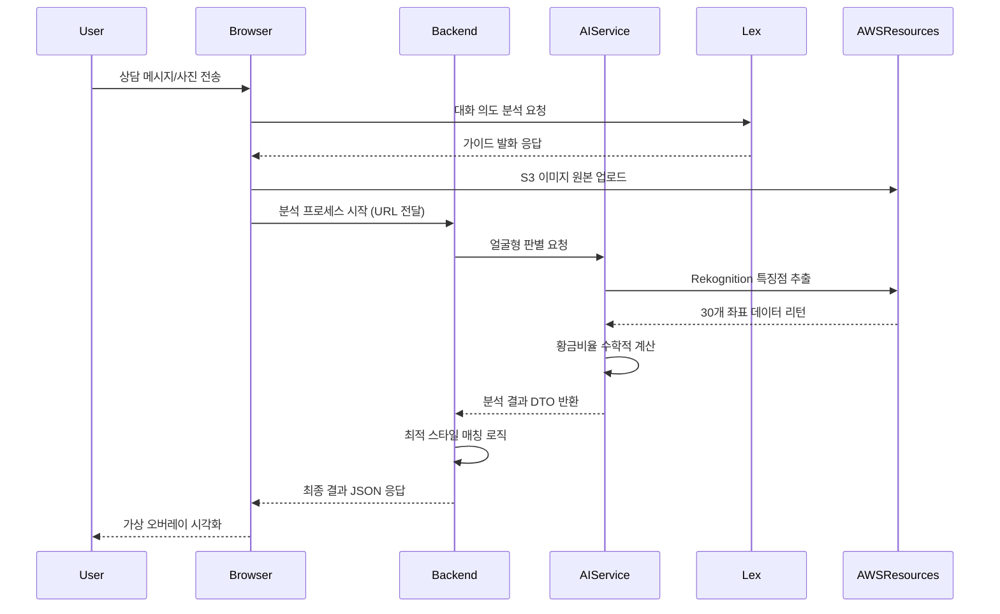
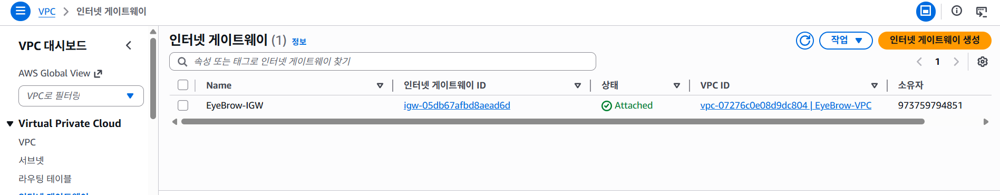
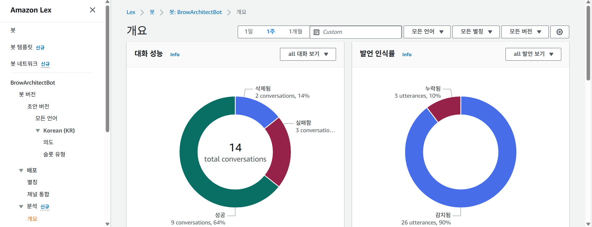

# 💄 Eye-Brow Architect: AI 기반 퍼스널 아이브로우 스타일링 솔루션

> **"당신만의 최적화된 아름다움을 설계합니다."**  
> Eye-Brow Architect는 AI 얼굴 분석 기술과 Amazon Lex 지능형 상담을 결합하여, 사용자의 얼굴형에 가장 어울리는 눈썹 스타일을 제안하고 가상 가이드를 제공하는 클라우드 네이티브 웹 애플리케이션입니다.

---

## 1) 주요 기능 (Key Features)

1.  **지능형 뷰티 컨설팅 (Amazon Lex V2)**
    *   **Context-Aware 상담**: 사용자의 상황(면접, 데이트, 데일리 등)에 따라 Lex 봇이 의도(Intent)를 파악하여 최적화된 스타일 제안.
    *   **Multi-turn Dialog**: 자연어 처리를 통한 대화형 인터페이스를 통해 복잡한 요구사항도 단계별로 수집 및 처리.
    *   **Error Handling**: 사용자의 오입력에 대한 슬롯 필링(Slot Filling) 및 재질의 로직을 통한 매끄러운 사용자 경험 제공.

2.  **정밀 얼굴 분석 전문 엔진 (Python/FastAPI)**
    *   **Rekognition 연동**: AWS Rekognition을 사용하여 얼굴의 30개 이상 특징점(Landmarks) 및 회전 각도(Roll, Pitch, Yaw) 정밀 추출.
    *   **황금비율 알고리즘**: 추출된 좌표를 기반으로 눈썹, 눈, 콧망울 간의 $1:1.5$ 황금비율을 수학적으로 계산.
    *   **얼굴형 판별 시스템**: 분석된 데이터를 바탕으로 5대 주요 얼굴형(달걀형, 둥근형, 긴형, 각진형, 역삼각형)을 판정하고 최적의 스타일 매칭.

3.  **실시간 가상 메이크업 오버레이 (Virtual Overlay) ⭐**
    *   **Canvas Drawing**: React와 HTML5 Canvas API를 사용하여 사용자의 사진 위에 분석된 좌표 기반의 다이나믹 가이드라인 생성.
    *   **정밀 좌표 렌더링**: 분석된 눈썹의 시작점, 산, 끝점 좌표를 시각화하여 사용자가 오차 없이 메이크업을 할 수 있도록 보조.
    *   **비결 보기 (Overlay Toggle)**: 원본 사진과 분석 가이드라인이 적용된 시뮬레이션 결과를 실시간으로 비교 확인 가능.

4.  **클라우드 네이티브 아키텍처 (EKS/IaC)**
    *   **Microservices Architecture (MSA)**: Frontend(React), Backend(Spring Boot), AI Service(FastAPI)를 독립적인 컨테이너로 분리 운영.
    *   **Auto Scaling**: Amazon EKS(Kubernetes)를 통해 트래픽 증가 시 자동으로 Pod를 확장하여 서비스 가용성 확보.
    *   **Infrastructure as Code (Terraform)**: 모든 클라우드 인프라를 코드로 관리하여 재현성 및 배포 안정성 극대화.

---

## 3) 기술 스택 (Tech Stack)

| Category | Technology |
| :--- | :--- |
| **Backend** | Java 21, Spring Boot 3.2.3, Python 3.12 (FastAPI), Maven |
| **Frontend** | React, JavaScript (ES6+), Vanilla CSS, HTML5 Canvas API |
| **Cloud (AWS)** | Amazon EKS, S3, RDS (MySQL), Lex V2, Rekognition, Lambda |
| **DevOps/Infra** | Terraform, Docker, Docker-Compose, GitHub Actions (CI/CD) |
| **Database** | MySQL 8.0, Hibernate/JPA (ORM), PostgreSQL (Compatibility) |

---

## 5) 환경 구분 (Environment)

*   **Local**: Docker Compose를 활용하여 전체 MSA 환경을 로컬 PC에서 1분 만에 구동.
*   **Dev (K8s)**: Minikube 또는 로컬 Kubernetes 환경에서 오버레이(Overlay) 설정을 통한 배포 테스트.
*   **Production (AWS EKS)**: 실제 도메인과 부하 분산(ALB)이 적용된 고가용성 운영 환경.

---

## 6) 개발환경 k8s 구성과 AWS 구성 구분

### 6-1. Dev Kubernetes
*   **Local Registry**: 로컬 이미지를 활용하여 빠른 개발 피드백 루프 생성.
*   **NodePort**: 외부 로드밸런서 없이 로컬 포트 포워딩을 통한 서비스 접근.

### 6-2. Amazon EKS (Production)
*   **Managed Node Groups**: AWS에서 최적화된 EC2 노드 그룹 운영.
*   **ALB Ingress Controller**: AWS 애플리케이션 로드밸런서와 연동하여 HTTPS 및 경로 기반 라우팅 지원.
*   **VPC CNI**: Pod에 실제 VPC IP를 할당하여 네트워킹 성능 최적화.

---

## 7) Docker 실행

### 7-1. 실행
```powershell
docker-compose up -d --build
```

### 7-2. 접속
*   **Frontend**: `http://localhost:3000`
*   **Backend API**: `http://localhost:8080`
*   **AI Service**: `http://localhost:8000`

---

## 12) Mermaid 다이어그램

### 12-1. 환경별 배포 흐름
개발자로부터 실제 운영 환경까지의 견고한 배포 파이프라인 구조입니다.



### 12-2. EKS 런타임 구조
고가용성을 보장하는 Amazon EKS 클러스터 내부의 트래픽 흐름입니다.



### 12-3. AI 얼굴 분석 및 상담 시퀀스
사용자 요청부터 AI 분석 및 챗봇 응답까지의 복합 프로세스입니다.



---

## 14) 화면 캡처 및 서비스 증적

### 14-1. 서비스 실행 화면 (Browser)
| 서비스 단계 | 화면 이미지 |
| :--- | :--- |
| **메인 대시보드** |  |
| **Lex 지능형 상담** |  |
| **얼굴 분석 리포트** |  |
| **사용자 이력 관리** |  |

### 14-2. AWS 인프라 운영 증적 (Console)
| AWS 리소스 | 콘솔 증적 리포트 |
| :--- | :--- |
| **Amazon EKS** |  |
| **Amazon ECR** |  |
| **Amazon S3/ALB** |  |
| **Amazon Lex V2** |  |
| **Amazon RDS** |  |

---

## 15) 주요 경로 (Project Structure Summary)
*   **`src/main/java/.../analysis/`**: AWS Lex 연동 컨트롤러 및 지능형 상담 서비스 로직
*   **`AI_Service/`**: FastAPI 기반 파이썬 얼굴 분석 엔진 및 알고리즘 구현부
*   **`Frontend/`**: React 라이브러리 기반 UI 및 HTML5 Canvas 드로잉 엔진
*   **`AWS/`**: EKS 클러스터용 Kubernetes Deployment/Service YAML 명세
*   **`docs/architecture/`**: Terraform(IaC)을 활용한 AWS 리소스 프로비저닝 코드

---
**Eye-Brow Architect** - *Constructing the future of personal beauty with Cloud Native AI.*
